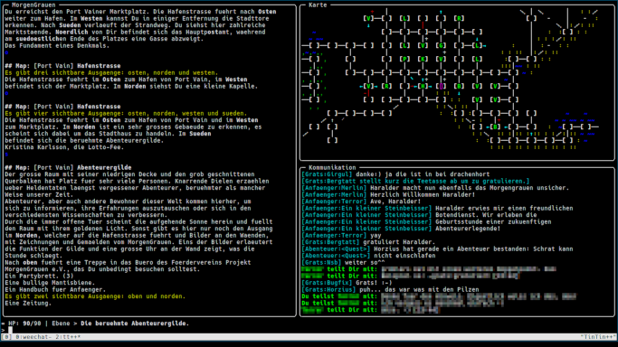
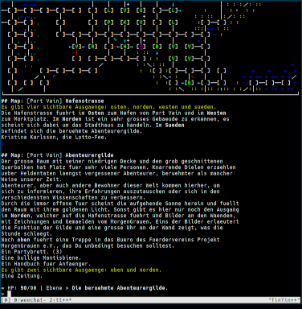
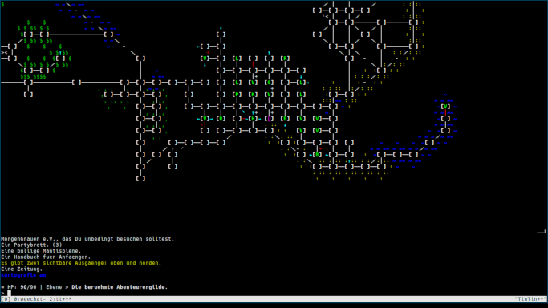

TinTin++ Konfiguration für MorgenGrauen
=======================================

Diese Repository beinhaltet meine [TinTin++](https://tintin.mudhalla.net/)
Konfiguration für das deutschsprachige
[MUD](https://de.wikipedia.org/wiki/Multi_User_Dungeon)
[MorgenGrauen](http://mg.mud.de/).

Features
--------

* verschiedene Layouts (siehe unten)
* Hervorhebungen für noch nicht kartografierte sichtbare Ausgänge
* Hervorhebungen für Räume mit nicht kartografierten sichtbaren Ausgängen
  * wird beim Betreten und Verlassen eines Raums aktualisiert
* automatisches Ersetzen von Umlauten
* [GMPC](http://mg.mud.de/cgi-bin/mgn-doc-search?help/GMCP) Integration
  * Vitalwerte in der Statusleiste
  * Kurzbeschreibung des Raums in der Statusleiste
  * Mitführen der Raum ID in der Karte und entsprechende Hinweise, wenn
    * ein Raum betreten wird, der bereits an anderer Stelle in der Karte
      existiert
    * die ID die vom Mud gemeldet wird nicht mit der Karte übereinstimmt

Die folgenden Features sind optional:

* automatisches Login
* periodisches Speichern des aktuellen Zustand der Karte
   * Versionierung der Karte mit git

Layouts
-------

Alle Screenshots stellen den identischen Spielzustand dar.

### Großes Layout

In diesem Layout gibt es einen großen Bereich für das eigentliche Spiel und
eigene Bereiche für die Karte und die Kommunikation (Ebenen, Mitteilungen und
Rufe). Dieses Layout ist aktiv, wenn das Terminal breiter als 164 Spalten ist.

### Kompaktes Layout

Wenn das Terminal nicht breit genug für das große Layout ist, wird auf dieses
Layout gewechselt. Hierbei wird ein Drittel des Terminals für die Karte
verwendet und der Rest für das eigentliche Spiel.

### Kartografie Layout

Da die Geographie des MorgenGrauens oft mit Erwartungen bricht, ist es
regelmäßig notwendig manuell die Karte nachzubessern. Dafür gibt es das
Kartografie Layout. Hierbei wird der Großteil des Bildschirms für die Karte
verwendet. Dieses Layout lässt sich mit `kartografie an` aktivieren (und
entsprechend mit `kartografie aus` wieder deaktivieren). Außerdem gibt es eine
eigene Konfiguration um diesen Modus ohne eine Verbindung mit dem MorgenGrauen
verwenden zu können: `tt++ -r mg_map.tin`.

So kannst Du diese Konfiguration verwenden
------------------------------------------

### Einfache Variante (ohne Autosave der Karte)

1. Installiere eine aktuelle Version von
   [TinTin++](https://tintin.mudhalla.net/install.php).
2. Klone dieses Repository oder lade dir ein
   [Archiv](https://github.com/blabber/tinin-morgengrauen/archive/refs/heads/main.zip)
   herunter (das Du dann natürlich auch entpackst).
3. (Optional) Um das Autologin zu verwenden, trage deine Logindaten in
   `tin/login.tin` ein.  Falls Du keinen Account hast fällt dieser Schritt
   natürlich weg. Du kannst deine Logindaten auch nachträglich eintragen.
4. (Optional) Falls du bereits eine in TinTin++ erstellte Karte hast, die du
   weiterbenutzen willst, kannst Du map/mg.map mit deiner Karte überschreiben.
5. Starte den Client aus dem Basisverzeichnis dieser Konfiguration:
   `tt++ -r mg.tin`.

Diese Konfiguration wird bei jedem Sitzungsende den aktuellen Zustand der Karte
speichern.

### Komplexere Variante (mit Autosave und Versionierung der Karte)

1. Installiere eine aktuelle Version von
   [TinTin++](https://tintin.mudhalla.net/install.php).
2. Klone dieses Repository.
3. Erstelle einen neuen Branch.
4. (Optional) Um das Autologin zu verwenden, trage deine Logindaten in
   `tin/login.tin` ein.  Falls Du keinen Account hast fällt dieser Schritt
   natürlich weg. Du kannst deine Logindaten auch nachträglich eintragen.
5. (Optional) Falls du bereits eine in TinTin++ erstellte Karte hast, die du
   weiterbenutzen willst, kannst Du map/mg.map mit deiner Karte überschreiben.
   Füge die neue Karte dem Repository hinzu und committe sie.
6. Öffne die Datei `tin/config.tin` und trage dort ein wie oft gespeichert
   werden soll und das Du git verwenden willst.
7. Starte den Client aus dem Basisverzeichnis dieser Konfiguration:
   `tt++ -r mg.tin`.

Diese Konfiguration wird bei jedem Sitzungsende und regelmäßig, wenn in der
Zwischenzeit Räume hinzugefügt oder gelöscht wurden, den aktuellen Zustand der
Karte speichern und in das Repository committen.

Um auf die aktuellste Version dieser Konfiguration zu wechseln kannst Du, nach
einer Aktualisierung deines Klons, einfach den Branch in dem du spielst auf den
aktuellen `origin/main` rebasen:

    git fetch
    git rebase origin/main

Hinweise zur Karte
------------------

Es sind folgende Richtungen für Ausgänge möglich: `n` (Norden), `s` (Sueden),
`w` (Westen), `o` (Osten), `nw` (Nordwesten), `no` (Nordosten), `sw`
(Suedwestem), `so` (Suedosten), `u` (Unten) und `ob` (Oben). Beim Arbeiten mit
der Karte müssen diese Kurzformen verwendet werden.

Im Morgengrauen gibt es manchmal exotischere Ausgänge (z.B. `vorne`, `hinten`
oder `ostunten`). In diesem Fall erstelle ich einen Ausgang in eine reguläre
Richtiung und weise den korrekten Wert als Kommando zu. Beim Identifizieren von
kartografierten Ausgängen wird das Kommando berücksichtigt und sollte korrekt
funktionieren.

Ein kleines Beispiel: Ich stehe in einem Raum mit einem Ausgang `ostunten`. Ich
lege einen Ausgang nach `o` and und weise `ostunten` als Kommando zu:

    #map dig o
    #map exit o command {ostunten}

Nun kann ich mit `o` dem Ausgang nach `ostunten` folgen und die Karte führt
meine Bewegung korrekt mit.

Auf den Screenshots sieht man, dass ich mit einer Unicode Karte (`#map flag
unicodegraphics`) spiele. Dies ist meiner Meinung nach die beste Art die Karte
auf der Konsole darzustellen. Allerdings benötigt diese Darstellung Glyphen,
die in normalen Fonts nicht enthalten sind. Ich verwende einen normalen
[Monospace Font](https://sourcefoundry.org/hack/) ergänzt durch die TTF Variante
von [GNU Unifont](http://unifoundry.com/unifont/index.html). Da ich nicht davon
ausgehe das jeder eine solche Konfiguration einsetzt, und die Gefahr von
Informationsverlust besteht, enthält diese Karte den Stub einer ASCII Karte
(`#map flag asciigraphics`).

Vereinfachte Navigation
-----------------------

Makro | Bewegung
----- | --------
Strg-← Strg-← | `w`
Strg-→ Strg-→ | `o`
Strg-↑ Strg-↑ | `n`
Strg-↓ Strg-↓ | `s`
Strg-↑ Strg-← | `nw`
Strg-← Strg-↑ | `nw`
Strg-↑ Strg-→ | `no`
Strg-→ Strg-↑ | `no`
Strg-↓ Strg-← | `sw`
Strg-← Strg-↓ | `sw`
Strg-↓ Strg-→ | `so`
Strg-→ Strg-↓ | `so`
Strg-Bild↑ Strg-Bild↑ | `ob`
Strg-Bild↓ Strg-Bild↓ | `u`

Wie ich spiele
--------------

Diese Konfiguration basiert auf meinen Präferenzen und ist sicher nicht für
jeden sinnvoll nutzbar. Insbesondere liebe ich das Erstellen der Karte, daher
ist ein Spielen ohne Karte mit dieser Konfiguration nicht vorgesehen. Eine
Alternative, die auch das Spielen ohne die Verwendung des Mappingtools von
TinTin++ ermöglicht, findet sich
[hier](https://github.com/rku/morgengrauen_tintin).

Außerdem habe ich gerne die Hoheit über die Karte, deswegen werden Roomname und
Roomarea nicht automatisch aus den GMCP Daten gefüllt. Ich beschrifte die Karte
selber. Entsprechend werden diese Beschriftungen beim Betreten eines Raums
auch immer, zusätzlich zu den GMCP Daten, ausgegeben (das sind die Zeilen, die
mit `## Map:` beginnen).

Die Räume lasse ich ich in der Regel durch den Automapper in die Karte
einzeichen. Wenn ich eine Warnung bekomme das ich einen Raum betrete der bereits
kartografiert wurde, lege ich selber Hand an die Karte an. Warnungen das Raum
IDs differieren behandle ich von Fall zu Fall unterschiedlich. Auf jeden Fall
werden beim Spielen mit dieser Konfiguration solide Kenntnisse mit dem TinTin++
Mapper benötigt.

Ich spiele in einem Terminal mit heller Schrift (grey90) und schwarzem
Hintergrund. Das spiegelt sich in den gewählten Farben wieder.

